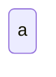
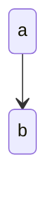
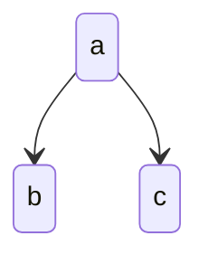
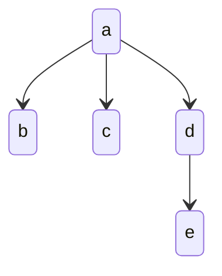
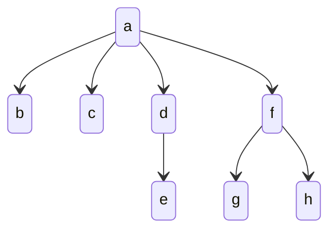
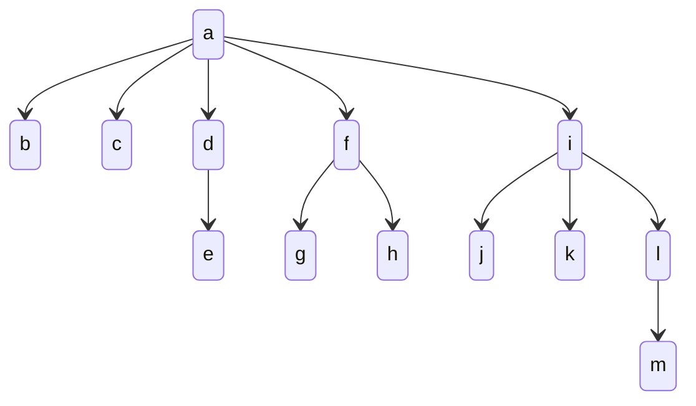
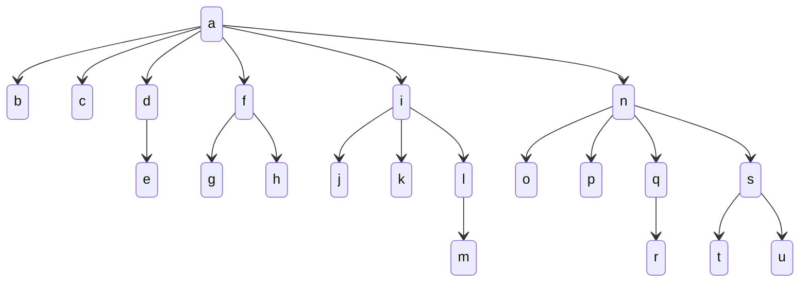

### Treść
(FIB)

Niech T_i oznacza najmniejsze pod względem liczby wierzchołków drzewo o rzędzie i, które może zawierać kopiec Fibonacciego. 

Narysuj drzewa T_i, dla i = 0,1,..., 6

------

Rozwiązanie

    
drzewo zawierać kopiec?

jeśli chodzi o narysowanie drzew o określonym rzędzie to:

