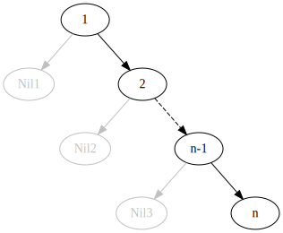
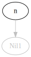
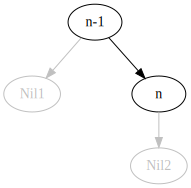
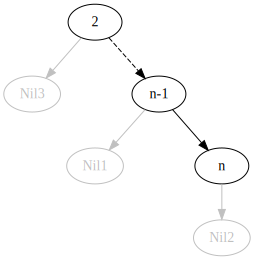
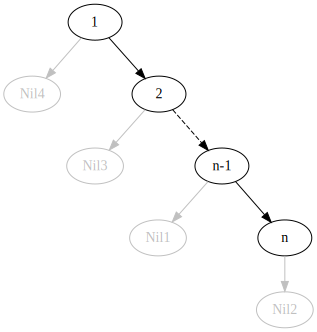
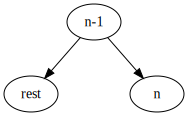
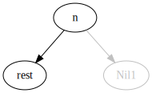

### Treść
(SPLAY)
Narysuj:

(a) drzewo Splay po wykonaniu na początkowo pustym drzewie ciągu operacji: 

insert(n), insert(n-1), ..., insert(2), insert(1)

(b) drzewo splay po wykonaniu operacji splay(n), splay(n-1) na drzewie otrzymanym w poprzednim punkcie

------

Rozwiązanie

    

#### (a)

[link](https://hackmd.io/e3hdCEaNRaOFnb0HQcPrQQ)

Odpowiedź do zadania:

Proces powstawania powyższego drzewa:

$$insert(n)$$

$$insert(n-1)$$

.\
.\
.

$$insert(2)$$

$$insert(1)$$

#### (b)
[link](https://hackmd.io/Zq2levFcQnCJGgKz9-nYNg?view)

Odpowiedź do zadania:

Proces powstawania powyższego drzewa:

$$splay(n)$$

$$splay(n-1)$$

