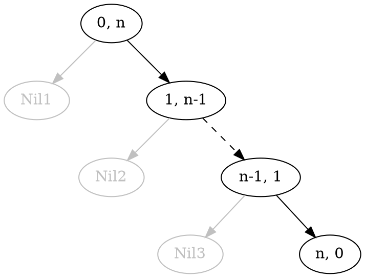
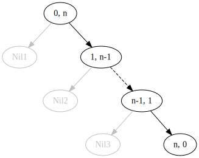

### Treść 
(TREAP)
(a) Podaj przykład drzewca (tj. podaj wartości kluczy wraz z przydzielonymi im priorytetami) o n wierzchołkach, w którym każdy wierzchołek wewnętrzny ma tylko prawego syna. 

(b) Następnie podaj, który wierzchołek będzie wymagał najwięcej rotacji podczas usuwania go. Ile to będzie rotacji? Odpowiedź uzasadnij.

------

Rozwiązanie

    
#### (a)

<0, n>, <1, n-1>, ..., <n-1, 1>, <n, 0>

#### (b)

Fakt. *Ilość rotacji po usunięciu klucza z drzewca jest sumą długości 
  skrajnej prawej ścieżki lewego syna klucza i 
  skrajnie lewej ścieżki prawego syna klucza.*

stąd, 

każdy wierzchołek (oprócz liścia liścia który ma zero rotacji) potrzebuje dokładnie 1 rotacji.
